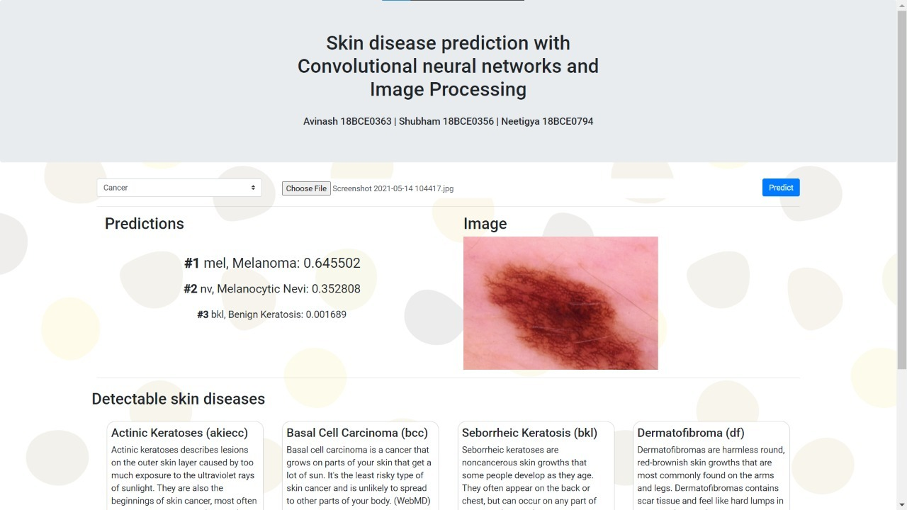

# Skin Lesion Classifier 
A predictive model that uses the HAM10000 dataset, trained on MobileNet to classify skin lesions into seven categories. Our model has been deployed on a web app. 

# Demo

## Acknowledgements

1. (Marsh's Skin Lesion Analyzer) - [https://www.kaggle.com/vbookshelf/skin-lesion-analyzer-tensorflow-js-web-app/notebook]
2. (HAM10000 Dataset) - [https://arxiv.org/ftp/arxiv/papers/1803/1803.10417.pdf]
3. (Skin Lesion Classification) - [https://arxiv.org/pdf/1812.02316.pdf]